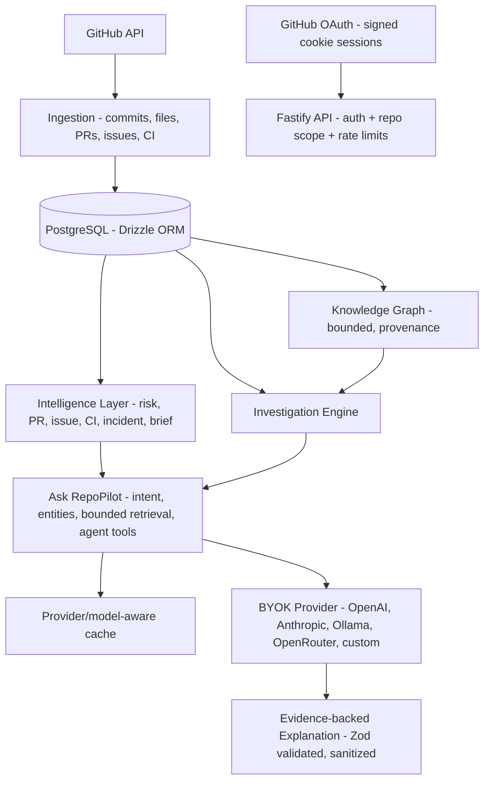

# RepoPilot

**AI Engineering Intelligence & Command Center**

> RepoPilot is an evidence-backed engineering intelligence layer for GitHub. It connects repositories, code, commits, pull requests, issues, CI/CD, contributors, and incidents into persistent engineering context — then uses AI to explain what the evidence means.

> GitHub tells you what happened. RepoPilot helps you understand the engineering context behind it.


---

## Why RepoPilot?

Modern engineering information is fragmented across pull requests, commits, issues, reviews, CI/CD runs, incidents, files, and contributors. GitHub stores these events, but engineers have to manually connect them to understand the larger engineering context.

RepoPilot is the missing layer:

```text
GitHub
  ↓
Engineering Activity
  ↓
RepoPilot
  ↓
Persistent Engineering Context
  ↓
Evidence-backed Intelligence
```

RepoPilot is **not** a generic AI chatbot, a ChatGPT wrapper, an analytics dashboard, a code scanner, a Copilot clone, an autonomous coding agent, or a developer performance-ranking system. It is **Engineering Memory + Evidence + Intelligence**.

---

## Evidence first. AI second.

The core architectural principle:

```text
GitHub data
  ↓
Ingestion
  ↓
Normalized engineering data (PostgreSQL)
  ↓
Deterministic intelligence
  ↓
Relationships / evidence
  ↓
Investigation context
  ↓
AI explanation
  ↓
Engineer
```

Deterministic systems collect and establish engineering evidence. The AI layer only explains that evidence — it is never the source of truth. Every factual claim traces back to repository records, and anything the data cannot establish is reported as an explicit **unknown**.

---

## What RepoPilot Does

All capabilities below are implemented in this repository:

- **GitHub repository connection** — OAuth sign-in, connect repositories, on-demand sync of commits, files, PRs, issues, CI workflows/runs, and contributors.
- **Engineering knowledge graph** — bounded, evidence-oriented graph over 10 entity types with provenance on every edge.
- **Engineering memory** — file history, change frequency, contributor activity, and timeline from synced history.
- **Risk intelligence** — deterministic risk findings (hot files, corrective activity, concentration) computed from synced data.
- **PR / issue intelligence** — change surface, linked commits/files, risk overlap, related CI and discussion signals.
- **CI/CD intelligence** — run history, failure streaks, unstable workflows, per-PR CI states.
- **Incident intelligence** — CI failure bursts reconstructed into incidents with timelines and linked evidence.
- **Investigation engine** — entity-scoped context: direct relationships, temporal context, repeated patterns, evidence package, explicit unknowns.
- **Ask RepoPilot** — natural-language engineering questions answered from deterministic evidence, with optional AI explanation.
- **BYOK AI providers** — 11 providers (OpenAI, Anthropic, Mistral, Groq, Together, Fireworks, Cerebras, OpenRouter, Ollama, LM Studio, custom OpenAI-compatible), live model discovery, encrypted credentials.

---

## The Core Idea: Engineering Memory

RepoPilot persists the relationships between engineering entities:

```text
Repository
   │
   ├── Files
   ├── Commits
   ├── Pull Requests
   ├── Issues
   ├── CI Runs
   ├── Contributors
   └── Incidents
```

So an investigation can traverse them:

```text
Incident
   ↓
File
   ↓
Commit
   ↓
Pull Request
   ↓
CI Run
   ↓
Contributor
```

This persistent relationship layer is reused across investigations and questions instead of being rebuilt per prompt.

---

## Investigation Engine

`GET /api/repositories/:id/investigation?entityType=<type>&entityId=<id>` builds a deterministic context for any commit, file, PR, issue, CI run, workflow, incident, or risk:

```text
Target
  │
  ├── Direct relationships
  ├── Temporal context (before / after)
  ├── Repeated patterns
  ├── Evidence
  └── Unknowns
```

Key distinction: **temporal or heuristic relationships do not imply causation.** The engine reports that a commit "occurred before" an incident — never that it caused it. Every relationship carries evidence IDs and provenance (source + reason), all queries are repository-scoped, and gaps are returned as explicit unknowns.

```text
Investigation
      ↓
Evidence Context
      ↓
Ask RepoPilot
      ↓
Grounded Explanation
```

---

## Ask RepoPilot

`POST /api/repositories/:id/ask` answers natural-language engineering questions in three stages:

1. **Deterministic retrieval** — rule-based intent classification, entity resolution against synced records, and bounded evidence assembly (max 60 items, max 3 conversation turns, max 30 history evidence IDs per turn).
2. **Agentic tool loop** — up to 5 deterministic tool executions (entity investigation, knowledge-graph search, file context, CI timeline, risk patterns) consolidated into the prompt. The loop runs with or without an AI provider, so the trace is always available.
3. **AI explanation** — the active provider/model reasons over the consolidated evidence package and returns structured JSON, validated with Zod; orphan evidence IDs are stripped at two layers.

Example questions (illustrative, not guaranteed answers):

```text
Why is this PR considered risky?

What changed around this incident?

Which components are connected to this failure?

Has this area caused similar problems before?

Show me the evidence behind this investigation.
```

Answers include the response, assessment, key findings with evidence citations, unknowns, and next investigation steps — each finding linked to canonical evidence IDs (`commit:`, `pr:`, `issue:`, `run:`, `incident:`, `risk:`, `file:`, `workflow:`, `contributor:`).

---

## Knowledge Graph

`GET /api/repositories/:id/graph` serves the engineering graph (depth ≤ 3, ≤ 500 nodes, ≤ 1000 edges). Node types: `repository`, `commit`, `file`, `contributor`, `pull_request`, `issue`, `ci_workflow`, `ci_run`, `risk`, `incident`. Every edge carries `evidenceIds` plus `provenance: { source, reason }`.

> Relationship ≠ causation. The graph shows what is connected through synced records — never inferred root cause.

---

## Evidence & Trust Model

- **Canonical evidence IDs** — every citable fact maps to a `kind:value` ID traceable to a synced record.
- **Provenance** — graph edges and findings record where they came from and why.
- **Explicit unknowns** — standard unknowns (no production telemetry, correlation ≠ causation, no CI logs beyond conclusions) plus per-answer gaps. Absence of evidence is never presented as evidence of absence.
- **No blame** — contribution data is never turned into rankings.
- **Untrusted repository text** — commit messages, issue bodies, and file names are treated as data, never instructions; injection regression tests enforce this.

---

## Architecture



---

## Technology Stack

| Layer    | Technology                                    |
| -------- | --------------------------------------------- |
| Frontend | React 19, Vite 8, Tailwind CSS 4, React Router 7 |
| Backend  | Node.js, Fastify 5, TypeScript                |
| Database | PostgreSQL, Drizzle ORM (12 migrations)       |
| Auth     | GitHub OAuth (`@fastify/oauth2`), signed cookies, AES-256-GCM credential encryption |
| AI       | OpenAI-compatible + native Anthropic adapters, Zod-validated responses |
| Quality  | Vitest, Testing Library, oxlint, `tsc -b`     |

---

## Repository Architecture

```text
.
├── src/                          # React frontend (Vite)
│   ├── pages/                    # 18 pages: Overview, Brief, Risks, PRs, Issues,
│   │                             #   CI/CD, Incidents, Timeline, Contributors,
│   │                             #   Components (planned), Knowledge Graph,
│   │                             #   Investigation, Ask RepoPilot, Settings, ...
│   ├── components/               # layout, ui primitives, repo, ai (ModelPicker)
│   ├── lib/api/client.ts         # typed API client
│   └── auth/                     # session context, protected routes
├── server/src/
│   ├── routes/                   # ask, investigation, graph, risks, pulls, issues,
│   │                             #   ci, incidents, brief, memory, ai-providers, ...
│   ├── services/                 # *-intelligence, *-analysis (AI), investigation,
│   │                             #   graph, agent-loop, agent-tools, ai-registry, ...
│   ├── db/                       # Drizzle schema + migrations
│   ├── auth/                     # session crypto, OAuth
│   └── middleware/               # auth, repository isolation, error handling
└── .env.example                  # documented environment template
```

---

## Engineering Intelligence

- **PR Intelligence** — change surface (files/commits), linked issues, risk overlap, CI states, contributor context.
- **Issue Intelligence** — linked PRs/commits, touched files, discussion signals, risk overlap.
- **CI/CD Intelligence** — run history with conclusions, consecutive-failure streaks, unstable workflows, recovery detection.
- **Incident Intelligence** — failure bursts on one workflow+branch become incidents with timeline, linked runs/commits/files/PRs/issues/risks, and recovery tracking.
- **Contributor Intelligence** — observed activity (commits, files touched, active windows). Counts only — never rankings.
- **Risk Intelligence** — hot files by change frequency, corrective-activity signals, contributor concentration. Deterministic analysis, not AI judgments.

Each module additionally offers an opt-in AI explanation layer; without a configured provider the UI serves deterministic results with an explicit unavailable state.

---

## Example Investigation

> Illustrative data — shows the shape of an investigation, not a real repository.

```text
Incident
"CI disruption: CI on main (4 failures, recovered)"

        ↓

Changed File
src/auth/session.ts  (6 recent changes — hot file)

        ↓

Commits
b2222222 "Rotate token signing secret"
d4444444 "Harden session cookie flags"

        ↓

CI Runs
qa-run-1 … qa-run-4 (failure) → qa-run-5 (success, recovery)

        ↓

Risk
medium: Hot file: src/auth/session.ts

        ↓

Unknowns
Root cause is not established — temporal correlation is not causation.
```

RepoPilot surfaces this evidence chain. It does **not** claim the commits caused the incident.

---

## Security & Repository Isolation

Verified in the implementation:

- GitHub OAuth with read-only identity scopes; no repository write scopes requested.
- Signed, HTTP-only session cookies; sessions resolved server-side per request.
- `requireRepositoryAccess` on every repository route — unknown, malformed, or foreign IDs return a privacy-preserving 404.
- All intelligence queries scoped by `repositoryId`; history and cache never cross repositories.
- API keys encrypted with AES-256-GCM; secrets never leave the server (responses, logs, and prompts are audited by tests).
- Per-route rate limiting (e.g. Ask and AI provider routes: 30 req/min).
- Zod/Fastify schema validation on requests and responses.

---

## AI Architecture

```text
Structured Retrieval
        ↓
Investigation Context
        ↓
Prompt Construction (system contract + bounded evidence)
        ↓
AI Provider (user's active provider + model)
        ↓
Structured / Validated Response (Zod + evidence sanitization)
        ↓
Evidence-aware UI
```

- **BYOK**: each user activates one of 11 providers with encrypted credentials; system env vars are a fallback, never a silent override.
- **Live model discovery** with per-user short-lived cache; providers without listing endpoints (Anthropic, custom) fall back to manual entry.
- **Test Connection** (credential check, no tokens spent) is distinct from **Test Model** (minimal probe completion).
- **Provider/model-aware cache**: switching models never serves another model's answer.

---

## Testing & Quality

Verified by running the suites for this README:

```text
Backend tests     ✓  399/399 (53 files)
Frontend tests    ✓  190/190 (21 files)
Typecheck         ✓  tsc -b (app + server)
Lint              ✓  oxlint (5 pre-existing warnings, no errors)
Production build  ✓  tsc -b && vite build
```

AI-specific regression coverage includes: active provider/model actually requested, cross-model cache isolation, fabricated/foreign evidence rejection, schema-invalid model output, cross-repository history isolation, and prompt-injection resistance.

> Live provider verification depends on configured credentials: with no API key configured, AI features deterministically report `unavailable` and the evidence remains fully usable. No fake AI status is ever shown.

---

## Getting Started

### Prerequisites

- Node.js 22+
- PostgreSQL 14+ (local instance)
- A GitHub OAuth app (for sign-in)

### Clone

```bash
git clone https://github.com/upendra7470/Repopilot.git
cd Repopilot
npm install
```

### Environment Variables

```bash
cp .env.example .env
```

| Variable             | Purpose                                  | Required |
| -------------------- | ---------------------------------------- | -------- |
| `DATABASE_URL`       | PostgreSQL connection                    | Yes      |
| `PORT`               | Backend port (default 3001)              | No       |
| `CORS_ORIGIN`        | Exact frontend origin for cookies        | Yes      |
| `FRONTEND_URL`       | Post-login redirect target               | Yes      |
| `AUTH_SECRET`        | Session signing + credential encryption (≥32 chars) | Yes (prod) |
| `GITHUB_CLIENT_ID` / `GITHUB_CLIENT_SECRET` | GitHub OAuth app | Yes (login) |
| `SESSION_TTL_HOURS`  | Session lifetime (default 168)           | No       |
| `AI_PROVIDER` / `AI_MODEL` / `AI_BASE_URL` / `AI_API_KEY` | Optional system AI fallback | No |

Per-user providers are configured in-app (Settings → AI Providers) and take precedence over system variables. Never commit real secrets.

### Database

```bash
npm run db:migrate
```

Applies the Drizzle migrations in `server/src/db/migrations`.

### Development

```bash
npm run dev:all
```

Runs the Vite frontend (`http://localhost:5173`) and the Fastify backend (`http://localhost:3001`) together. Or separately: `npm run dev`, `npm run dev:server`.

### Tests

```bash
npm run test:server   # backend (Vitest, needs PostgreSQL test DB)
npm test              # frontend (Vitest + Testing Library)
```

### Build

```bash
npm run build         # typecheck + production frontend build
npm run build:server  # backend typecheck build
npm run typecheck     # both projects, no emit
npm run lint          # oxlint
```

---

## Product Flow

```text
1. Sign in with GitHub
        ↓
2. Connect repository
        ↓
3. Sync engineering history
        ↓
4. RepoPilot builds engineering context
        ↓
5. Explore intelligence (Risks, PRs, Issues, CI/CD, Incidents, Graph)
        ↓
6. Investigate relationships
        ↓
7. Ask RepoPilot
        ↓
8. Trace answers back to evidence
```

---

## Design Philosophy

- **Evidence over assumptions** — every claim cites synced records.
- **Context over isolated events** — relationships persist and are reused.
- **Deterministic analysis before AI** — models explain; they don't establish facts.
- **Uncertainty should be visible** — unknowns are first-class output.
- **Repository data stays scoped** — isolation is enforced, not assumed.
- **AI explains, never fabricates** — validation and sanitization are structural, not optional.

---

## Roadmap

**Implemented** — everything in [What RepoPilot Does](#what-repopilot-does).

**Planned** — component-ownership surface (the Components page honestly reports this; area stats already feed PR intelligence and risks). No other future items are claimed.

---

## Project Status

RepoPilot is under active development. All listed capabilities run against real GitHub data and PostgreSQL; AI explanation features require a configured provider (in-app BYOK or system env vars) and otherwise degrade to explicit unavailable states.

---

## Contributing

Issues and pull requests are welcome. Please keep the evidence-first contract: deterministic facts from synced data, AI as explanation only, repository isolation on every route, and tests for new behavior (`npm run test:server`, `npm test`, `npm run typecheck`, `npm run lint`).

---

## License

No license file is present in this repository yet — one should be added before public distribution.

---

> **RepoPilot turns GitHub history into engineering memory.**

```text
GitHub tells you what happened.
RepoPilot helps you understand why the context matters.
```
